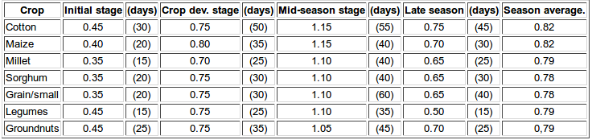
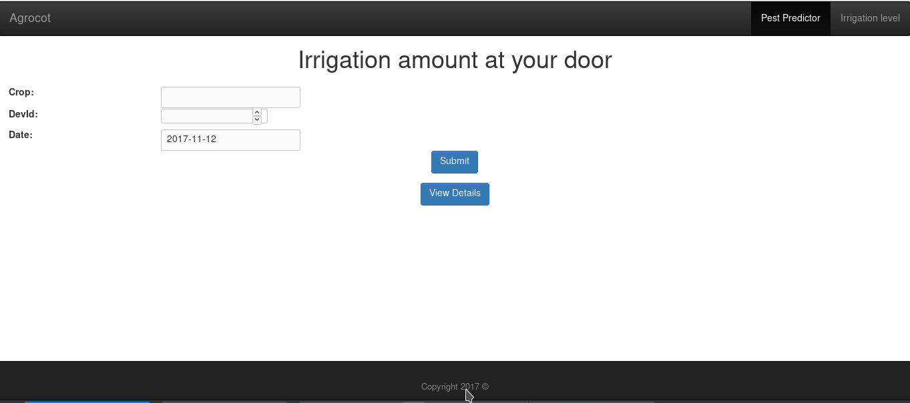

# Agrocot

In 2010 only 35% of total agricultural in India was reliably Irrigated. India has spent Rs.16,590 crore on irrigation development between 1950-85, 
and between 2000-10 India proposed to spend a sum of Rs.1,03,315 crores on irrigation. Hence we propose an optimal solution irrigation 
and pest and disease detection where we can make well informed decision and improve quality of the Yield.

## Project Description

* Part 1: Irrigation

We will have a solenoid valve or another digitally controlled device at the mouth of the canal pipe/stream, 
which will act as a local server for our each of our smaller client devices installed at various smaller regions 
under the respective canal pipe/stream. We also have temperature and humidity sensor installed with each of our smaller 
device at the field, which continually provide us real time sensor data. With this real time data we are able to calculate the water requirement via the formula :
```
ETcrop = Kc x Eto
```
where:  
ETcrop = the water requirement of a given crop in mm per unit of time e.g. mm/day, mm/month or mm/season.  
kc = the "crop factor"  
ETo = the "reference crop evapotranspiration" in mm per unit of time e.g. mm/day, mm/month or mm/season.  
Kc is easily availaible to us using the table provided :


ETo is the eavapotranspiration which can be calculated using various methods, we tried various methods like using relative humidity and temperature values and through the satelite data availaible to us via public API's.
This way we were able to control the water flow of local server installed at canal pipe/stream and it further signaled each of the devices installed at each of the individual fields to allow certain amount of water to flow through. We set up a MQTT network to connect each of the clients to the local server device.

* Part 2: Pest prediction and Detection

What we realized is that different kind of pests and diseases grow at their respective temperatures, relative humidity and rainfall. Since we have real time values of temperature and humidity, we tried to create a model from which we can predict growth a particular pest for a particular crop.
After that to validate our prediction we ask the farmer to upload a Photo of his crops to our portal where we use a model of Convolution Neural Network to detect pests and disease. We also calculated a raw average to the NDVI value of previous years data, to compare with the farmers current lands vegetation index and display it on our portal(Due to lack of time we couldn't visualize better data and fit a gaussian curve to the NDVI index)

## Screenshots


## Team Members
* [Divyam Madaan](https://github.com/divyam3897)
* [Radhika Dua](https://github.com/Radhikadua123)
* [Hardik Aggarwal](https://github.com/haragg2)
* [Aarush Gupta](https://github.com/aarush22)
